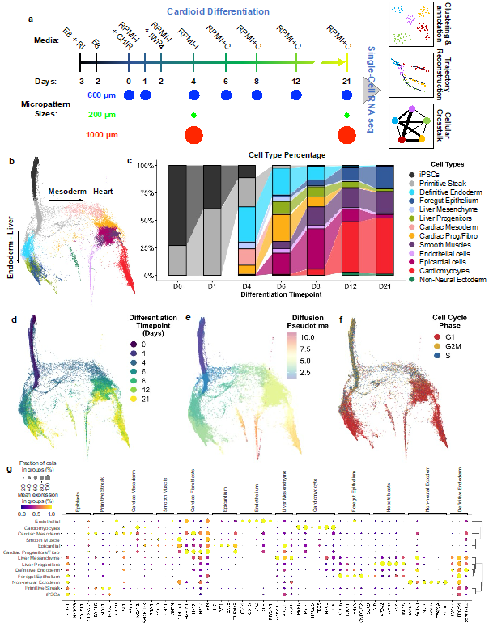

# scCardiacOrganoid
Time-course analysis of iPSC-derived cardiac organoid differentiation

### Collaboration between the Ma (Syracuse) and Cosgrove (Cornell) labs

### Subdirectory descriptions:
- `notebooks`: Jupyter/RMarkdown notebooks containing all of the data preprocessing and analysis done in this study
- `scripts`: All the other code we used! Mostly contains R scripts and utility functions used in our spatial analyses
- `resources`: assorted metadata, gene lists, and other information that we used to analyze our data
*see README files in each subdirectory for more details*

### Data generated for this paper:
- scRNAseq datasets: [GSE###](TODO)

### Contact:
- Zhen Ma (zma112@syr.edu)
- Benjamin D. Cosgrove (bdc68@cornell.edu)
- David W. McKellar (dmckellar@nygenome.org)
- Plansky Hoang (phoang@syr.edu)
- Andrew Kowalczewski (ankowalc@syr.edu)
